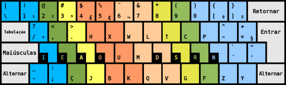

=======================================================
teclado-br - drivers inovadores para teclado brasileiro
=======================================================

Este projeto contém os seguintes layouts de teclado:

1) **BRDK - Dvorak brasileiro**, para Unix, Mac e Windows (XP, Vista, 7, 10 etc.)

.. image:: ./br-dvorak.png

2) Teclado brasileiro nativo, para Unix e Mac.

3) **QWEBR**, um layout QWERTY que tem vantagens sobre o ABNT2 e sobre o US-International.
Neste momento, somente para Windows. (Contribua...)

.. image:: windows/QWEBR/1-normal.png

4) **BR-dual**, em que a tecla Caps Lock alterna entre QWERTY e Dvorak.
Neste momento, somente para Windows. (Contribua...)

Por que usar um leiaute de teclado Dvorak?
------------------------------------------

Vide http://dev.nando.audio/pages/teclado.html

Status do projeto
-----------------

- `layouts para Windows <windows/>`_
- `layouts para Linux e assemelhados <unix/>`_
- `layouts para Apple Mac <mac/>`_

Mas e os **outros sistemas operacionais**?

Colaboração *open source* é bem-vinda e por isso é que os fontes estão no
`github <https://github.com/nandoflorestan/teclado-br>`_.
Para quaisquer outras ideias, pode
`criar um ticket <https://github.com/nandoflorestan/teclado-br/issues>`_.

Créditos
--------

Os arquivos deste projeto são de domínio público, resultado do trabalho de:

- Ari Caldeira (criador do Brasileiro Nativo; novo brdk p/ Unix)
- `Gabriel Marquez <https://github.com/gblmarquez>`_
  (novos drivers brdk p/ Windows)
- Heitor Moraes (brdk e documentação)
- Luiz Portella (brdk p/ Unix)
- `Nando Florestan <https://github.com/nandoflorestan>`_
  (brdk p/ Unix e Windows, QWEBR para Windows e documentação)
- `Victor Fonseca <https://github.com/victor-fonseca>`_
  (brdk p/ Mac e documentação)
- `amagnoni <https://github.com/amagnoni>`_
  (br nativo p/ Mac)

Contribua
---------

Ao fazer um *pull request* neste projeto, você concorda em
doar o seu trabalho para o domínio público.
