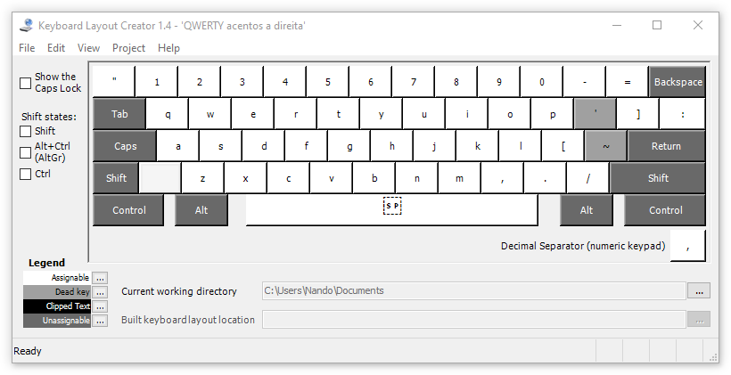
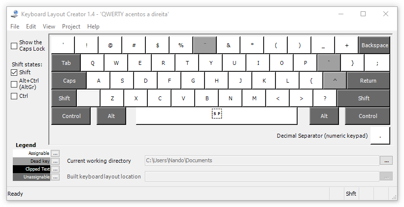
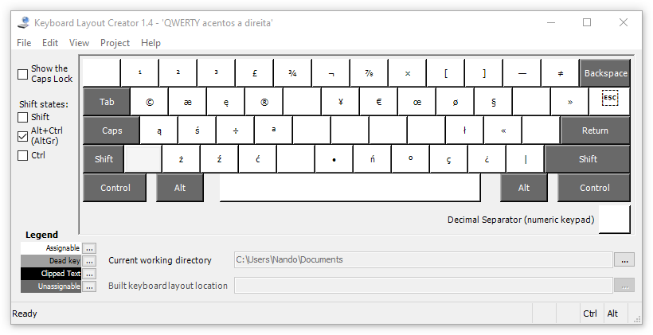
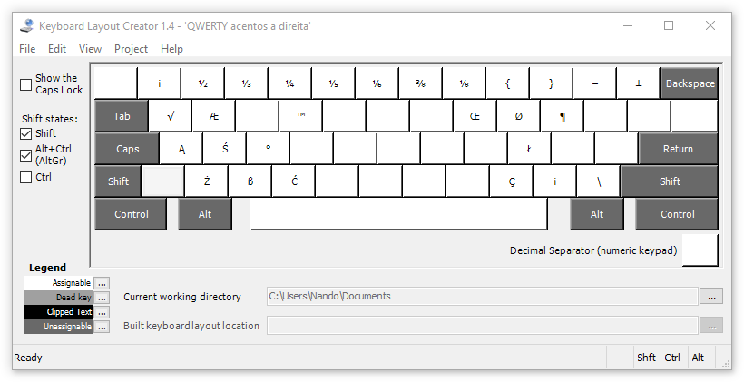

====================================
QWEBR - QWERTY com acentos à direita
====================================

O teclado brasileiro ABNT2 tem algumas características desejáveis que fazem
falta no layout "US - International", principalmente a colocação das teclas
mortas no mindinho direito.

Vivendo na Polônia, comprei um computador em 2019 e me faltou o teclado ABNT2,
que precisaria ser importado a um preço proibitivo.  Foi mais fácil criar este
layout, para o qual é indiferente se você tem um teclado ABNT2
ou um US-International.

Meu layout não tem a tecla específica para o cê cedilha (que você encontra
no ABNT2), porém você pode produzir o Ç de várias formas:

1. Alt Graphic + vírgula;
2. Tecla morta de acento agudo, e depois a letra C;
3. Tecla morta de til, e depois a letra C (porque é um erro que cometo com frequência).

Veja as 4 figuras neste diretório para entender o layout.

As teclas mortas para os acentos estão exatamente no mesmo lugar que no ABNT2,
basta você não olhar para o teu teclado e procurá-las por memória digital,
teu mindinho lembra onde estão os acentos embora você não lembre...

A tecla à esquerda do número 1 tem acento grave (crase) e til no US,
mas no ABNT tem aspas simples e duplas.  Optei por inverter a segunda opção:
Temos aspas duplas por padrão, e as aspas simples (menos usadas)
são acessadas com shift.

O teclado US tem a tecla Enter (ou Return) pequena demais, com altura de
apenas uma linha.  A tecla acima dela tem barra invertida e "pipe" ``|``.
Optei por colocar estes caracteres, pouco usados, na mesma tecla que a
barra simples (via AltGr).  Na tecla assim liberada coloquei os dois pontos
``:`` e o ponto-e-vírgula ``;`` com shift, pois o ponto-e-vírgula é menos
usado, exceto em linguagens de programação de pouca ergonomia.
Por falar nisso, viva Python!

O idioma polonês é suportado neste teclado, pois os caracteres acentuados do
polonês estão disponíveis pela tecla AltGr, exatamente como no teclado polonês.
Isto provavelmente não te interessa, mas também não vai te atrapalhar.
Evidentemente, este layout dá conta de todos os idiomas suportados pelo
US-International e pelo ABNT2.

Instalação
==========

Baixe a última versão do projeto "teclado-br" aqui:
https://github.com/nandoflorestan/teclado-br/archive/master.zip

Descompacte o zip -- ele contém vários layouts de teclado para vários
sistemas operacionais. Saiba mais sobre eles em
https://github.com/nandoflorestan/teclado-br

Dentro do subdiretório ``windows``, entre em ``QWEBR``.
O instalador está dentro da pasta "setup".  Basta clicar duas vezes no
arquivo *setup*.  Se você não vir nada acontecer, atente para a barra
de programas, o instalador estará ali piscando...

O Windows não permite usar o layout imediatamente após a instalação --
é necessário fazer *sign out* antes.  Simplesmente saia com teu usuário e
volte -- não é necessário reiniciar, embora isto também funcione.
Ao entrar novamente será possível usar o layout.

Alteração do layout
===================

Este layout é doado pelo autor, Nando Florestan, ao domínio público --
você pode fazer o que quiser sem nenhuma limitação.

Se quiser mexer nalgum detalhe do teclado, encontre o fonte dentro de ``src/``
e abra-o no programa Microsoft Keyboard Layout Creator.
`Veja como fazer isso aqui. <../>`_

Conselhos
=========

1. Aprenda datilografia (digitação com os dedos corretos) -- não é difícil e você leva para a vida inteira.
2. Qualquer layout QWERTY é pavoroso do ponto de vista da ergonomia.  Tente aprender o layout Dvorak (somente quando já souber datilografia), mas precisa ser num momento da sua vida em que você não tenha nada para entregar, porque aprender um segundo layout tão diferente é uma coisa extremamente frustrante e que pode levar meses.  No meu terceiro dia quase desisti.  Mas hoje sou fluente tanto em Dvorak quanto em QWERTY.  Mais informações em http://dev.nando.audio/pages/teclado.html
