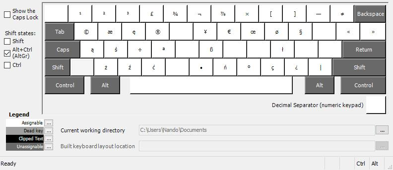
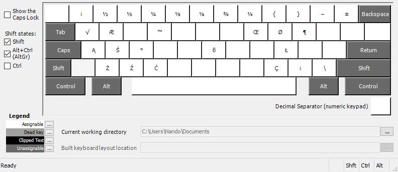
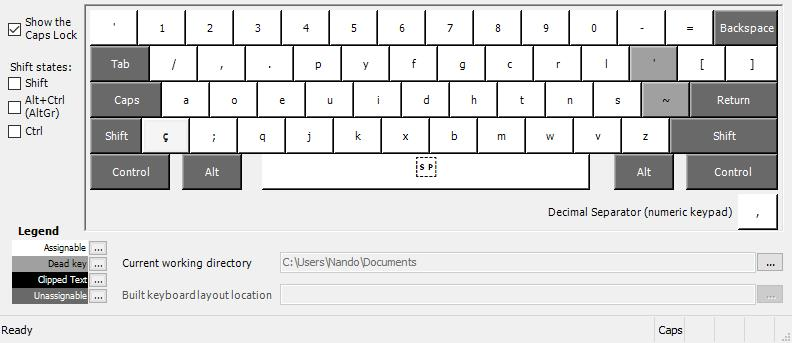
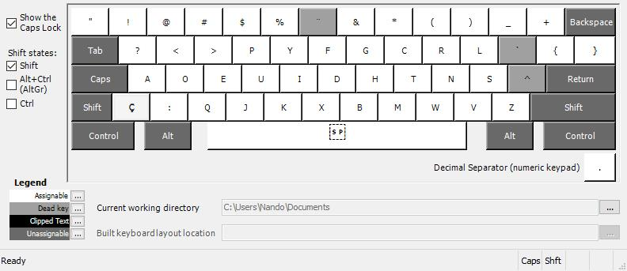

# BR-dual - QWERTY e Dvorak no mesmo layout

## Descrição

Este layout começa QWERTY, mas quando você liga Caps Lock, ele se torna Dvorak.
Não é um layout bom para GRITAR em maiúsculas (pois Caps Lock não ativa as
maiúsculas), mas é bom para alternar entre Dvorak e QWERTY.

Os atalhos de teclado que usam CTRL são entendidos no layout QWERTY, mesmo que
Caps Lock esteja ligado.  Isso é ótimo para:

- copiar com CTRL-C usando só a mão esquerda,
- colar com CTRL-V sem tirar a mão direita do mouse,
- cortar com CTRL-X sem ter de pensar onde está o X,
- salvar com CTRL-S sem olhar se Caps Lock está aceso ou não,
- fechar documento com CTRL-W usando só a mão esquerda, e assim por diante.

Os atalhos que usam Alt Graphic também só existem no layout QWERTY.
Afinal, esse Alt direito é o mesmo que CTRL + ALT.

Teu teclado físico pode não ter a tecla do cê cedilha (presente
no ABNT2), porém você pode produzir o Ç de várias formas:

1. Alt Graphic + vírgula.
2. Tecla morta de acento agudo, e depois a letra C.
3. Tecla morta de til, e depois a letra C (pois é um "erro" frequente).
4. Tecla do acento agudo, e depois a letra J (confusão entre QWERTY e Dvorak).
5. Tecla morta de til, e depois a letra J (confusão entre QWERTY e Dvorak).
6. Tecla morta de til, e depois a letra I (confusão entre QWERTY e Dvorak).

Veja as figuras neste diretório para entender o layout.

As teclas mortas para os acentos estão exatamente no mesmo lugar que no ABNT2
e no BRDK.

As teclas que mudam em função do Caps Lock são tão poucas quanto possível:
apenas as letras e 4 teclas de pontuação que fazem parte do Dvorak original.

O idioma polonês é suportado neste teclado, pois os caracteres acentuados do
polonês estão disponíveis pela tecla AltGr, exatamente como no teclado polonês.
Isto provavelmente não te interessa, mas também não vai te atrapalhar.
Evidentemente, este layout dá conta de todos os idiomas suportados pelo
US-International e pelo ABNT2.

Com Caps Lock:

Com Caps Lock e Shift:

## Para quem é este teclado?

Na minha opinião este layout é a melhor opção disponível em 2022, porém
seus benefícios aparecem para quem é fluente nos dois layouts, QWERTY e Dvorak.

Eis a história de Nando, um usuário:

1. Quando criança ele aprendeu datilografia.
2. Ele usava QWERTY porque é o que existe por aí, mas seus pulsos doíam
   ao fim de um dia de trabalho.
3. Procurando uma alternativa, Nando viu que o Dvorak seria muito mais
   confortável e dedicou meses a aprendê-lo.  Apesar da frustração inicial
   as dores passaram devido à economia de movimentos.
4. Nos dois primeiros anos, ao voltar para um computador sem Dvorak, Nando
   descobria que fazia confusão nos primeiros minutos, mas depois o QWERTY
   lhe voltava.
5. Alguma coisa ainda não estava ótima, então Nando experimentou o Brasileiro
   Nativo e o Colemak, mas voltou ao Dvorak que é tão equilibrado e dá
   tanto paralelismo às mãos.
6. A digitação de texto melhorou, mas agora havia um desconforto na
   hora dos atalhos de teclado, que preferem a mão esquerda, de modo que a
   mão direita possa permanecer no mouse.  No Dvorak ficam desconfortáveis
   e aumentam a necessidade de a mão direita voltar para o teclado.
7. Finalmente bolou o layout **BR-dual** para digitar texto no Dvorak e usar o
   QWERTY para outras coisas, tais como jogos de ação e editores que usam
   muitos atalhos de teclado.

## Instalação

Baixe a última versão do projeto "teclado-br" aqui:
https://github.com/nandoflorestan/teclado-br/archive/master.zip

Descompacte o zip -- ele contém vários layouts de teclado para vários
sistemas operacionais. Saiba mais sobre eles em
https://github.com/nandoflorestan/teclado-br

Dentro do subdiretório ``windows``, entre em ``br-dual-v2``.
O instalador está dentro da pasta "setup".  Basta clicar duas vezes no
arquivo *setup*.  Se você não vir nada acontecer, atente para a barra
de programas, o instalador estará ali piscando...

O Windows não permite usar o layout imediatamente após a instalação --
é necessário fazer *sign out* antes.  Simplesmente saia com teu usuário e
volte -- não é necessário reiniciar, embora isto também funcione.
Ao entrar novamente será possível usar o layout.

## Alteração do layout

Este layout é doado pelo autor, Nando Florestan, ao domínio público --
você pode fazer o que quiser sem nenhuma limitação.

Se quiser mexer nalgum detalhe do teclado, encontre o fonte dentro de ``src/``
e abra-o no programa Microsoft Keyboard Layout Creator.
`Veja como fazer isso aqui. <../>`_
