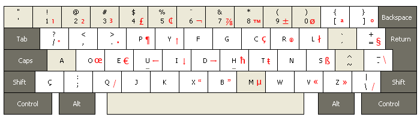

======================================
BRDK (Dvorak brasileiro) para Windows
======================================

Instalação
==========

Baixe a última versão do projeto "teclado-br" aqui:
https://github.com/nandoflorestan/teclado-br/archive/master.zip

Descompacte o zip -- ele contém vários layouts de teclado para vários
sistemas operacionais. Saiba mais sobre eles em
https://github.com/nandoflorestan/teclado-br

Dentro do subdiretório ``windows``, entre em ``brdk``.
O instalador está dentro da pasta "setup".  Basta clicar duas vezes no
arquivo *setup*.  Se você não vir nada acontecer, atente para a barra
de programas, o instalador estará ali piscando...

O Windows não permite usar o layout imediatamente após a instalação --
é necessário fazer *sign out* antes.  Simplesmente saia com teu usuário e
volte -- não é necessário reiniciar, embora isto também funcione.
Ao entrar novamente será possível usar o layout.

Alteração do layout
===================

Este layout é doado pelo autor, Nando Florestan, ao domínio público --
você pode fazer o que quiser sem nenhuma limitação.

Se quiser mexer nalgum detalhe do teclado, encontre o fonte dentro de ``src/``
e abra-o no programa Microsoft Keyboard Layout Creator.  Há neste projeto
outro arquivo de texto que ensina a instalar esse programa no Windows.
